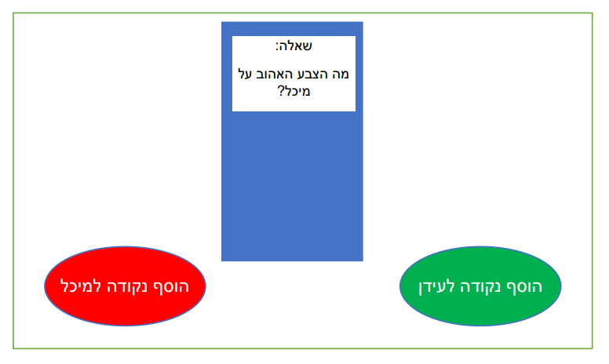
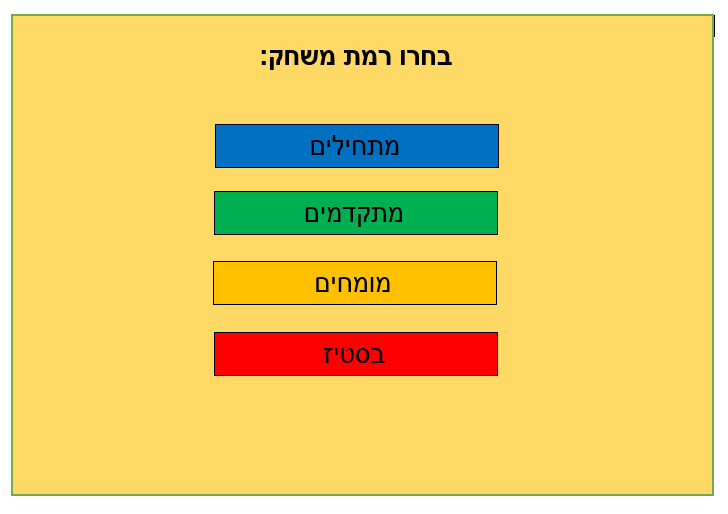

# משחק השאלות

**חושבים שאתם מכירים את החברים שלכם? בואו תוכיחו את זה!**

## מהות המשחק

משחק החברה האולטימטיבי! באמצעות מאגר שאלות גדול,
ברמות ושונות ובנושאים מגוונים המשחק שלי הוא המענה המושלם לערב
חברה חוויתי ומעניין!
במשחק שלי כל משתתף בתורו שולף כרטיס וירטואלי ועליו שאלה על אחד
המשתתפים האחרים (שמות המשתתפים ומינם מוזנים למערכת בפתיחת
המשחק). אם המשתתף צדק בשאלה הוא מקבל נקודה. אם טעה – מי שעליו
נשאלה השאלה מקבל את הנקודה.
כמה פשוט ככה כיף! המשחק מיועד לכל גדלי הקבוצות, לכל רמות ההיכרות ולכל הגילאים –
חברי ילדות, בני זוג, מפגש חברתי ראשון במסגרת כלשהי ועוד.
המשחק מיועד לסמארטפונים.
בוא לגלות כמה אתה מכיר את החברים שלך!

 
---

## פרטי המשחק

### 1. מה רואים?

* מסך המשחק מורכב מחפיסת קלפים כאשר בכל פעם ששחקן לוחץ עליה עולה מולו קלף עם שאלה על שחקן אחר. אם השחקן צדק הוא ילחץ על כפתור "צדקתי" ואם טעה ילחץ על כפתור "טעיתי".
* לא ניתן לצאת מגבולות המסך ואין תזוזה של מצלמה במשחק.

 

### 2. מה עושים?

המשחק בנוי מסבבים - כל שחקן בתורו לוקח קלף מהקופה ועונה על השאלה המופיעה בקלף.

* תהליך ההתחלה של המשחק - השחקנים מזינים את שמותיהם ומינם למערכת. הם יעשו זאת על ידי שימוש במקלדת. השמות ישמרו לתוך שדה "name" באובייקט "player".
*	תהליך הליבה של המשחק – על פי סבב, כל שחקן בתורו לוקח אלף מהקופה. על הקלף מופיעה שאלה הנוגעת למשתתף אחר עליה השחקן צריך לענות. אם צדק הוא מקבל נקודה. אם טעה השחקן עליו נשאלה השאלה מקבל נקודה. הנקודות יעודכנו בשדה "score" באובייקט "player".
*	תהליך הסיום של המשחק – המשחק מסתיים אם שחקן מגיע למספר נקודות כלשהו (נגיד 10) או שהשחקנים החליטו שהם לא רוצים להמשיך לשחק ואז מי שיש לו הכי הרבה נקודות באותו רגע הוא ההמנצח.

### 3. מה העצמים?

* אובייקט "Player" - אובייקט פנימי בו נשמרים הפרטים של כל שחקן במשחק (שם, מין וניקוד).
* קלפים - אובייקט חיצוני עליו יופיעו השאלות
* נקודות - המשאב שמי שצובר הכי הרבה ממנו הוא המנצח במשחק.

### 4. מה האפשרויות?

* בפתיחת המשחק השחקנים יכולים לבחור את רמת המשחק על פי רמת ההיכרות שלהם:
** מתחילים - לא מכירים אחד את השני
** מתקדמים - שחקנים בעלי היכרות מוקדמת מעטה
** מומחים - שחקנים בעלי היכרות עמוקה
** בסטיז - מיועד לשחקנים שבטוחים שהם יודעים הכל אחד על השני

### 5. מה העולם?

* באיזה עולם מתרחש המשחק?  באיזו סביבה?
* האם העולם יהיה סגור או פתוח?  עגול או שטוח? 
* מה הם חוקי הפיסיקה, הטבע, הגיאוגרפיה, ההסטוריה, הכלכלה, החברה והפוליטיקה בעולם שלכם?
* איזה חוקים יגבילו את פעולות השחקן במשחק?
* לפי איזה חוקים ייקבעו תוצאות של פעולות במשחק?

הוסיפו מפות ותרשימים של העולם.

### 6.	מה הסיפור?
*	מהו סיפור הרקע של המשחק – מה קרה לפני שהמשחק התחיל?
*   מהי עלילת המשחק - מה קורה במהלך המשחק ואיך השחקן משפיע על העלילה?

הוסיפו תרשים המתאר את הקשת הדרמטית.

### 7.	מי הדמויות?

*   מה התכונות שלהן, מה התפקיד שלהן במשחק, ואיך הן ייראו?
*	דמויות מרכזיות -  מי יהיה ה"גיבור" ומי ה"מתנגד" העיקרי? 
*	דמויות משניות – מי הן יהיו, ומה כל אחת תוסיף לחוויית השחקן? 

הוסיפו תרשימים של הדמויות.

## שלבים במשחק

תארו לפחות 
N+1
שלבים שונים שיהיו במשחק. הסבירו את המבנה של כל שלב ואת ההבדלים ביניהם.

---

## סקר שוק

לפני שמתחילים לעבוד על משחק (או כל מוצר אחר), חשוב לוודא שלא עשו את זה קודם. לא נעים לעבוד סמסטר שלם (או שנה שלמה) על משחק ואז לגלות שכבר יש משחק כזה. 

חפשו בגוגל, בחנות play, בפייסבוק, ובכל מקום אחר שיש לכם גישה אליו, משחקים דומים לרעיון שלכם. ציינו באיזה ביטויי-חיפוש השתמשתם.

זהו את שלושת המשחקים הדומים ביותר. לגבי כל אחד מהם:

* שימו קישור וצילום-מסך להמחשה.
* הסבירו מה תעשו כדי שהמשחק שלכם יהיה שונה/מקורי/מיוחד/טוב יותר מהמתחרים?  מדוע שחקנים יעדיפו דווקא את המשחק שלכם?

